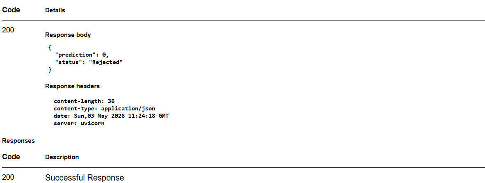

# Loan Default Prediction System
This project demonstrates a production-ready ML pipeline with modular architecture and real-time inference using FastAPI.

## 📌 Problem Statement

Financial institutions need to assess whether a loan applicant is likely to default or not.  
This project builds a machine learning system to automate loan approval decisions based on applicant details such as income, loan amount, and credit history.

## ⚙️ Tech Stack

- Python
- Pandas, NumPy
- Scikit-learn
- FastAPI
- Uvicorn
- YAML (for configuration)

## 🧱 Project Structure

    loan-default-prediction-system/
    │
    ├── src/
    │ ├── components/
    │ │ ├── data_ingestion.py
    │ │ ├── data_validation.py
    │ │ ├── data_transformation.py
    │ │ ├── model_trainer.py
    │ │ ├── model_evaluation.py
    │ │
    │ ├── pipeline/
    │ │ ├── training_pipeline.py
    │ │ ├── prediction_pipeline.py
    │ │
    │ ├── logger.py
    │ ├── exception.py
    │
    ├── data/
    │ └── loan.csv
    │
    ├── artifacts/
    │ └── (generated during execution)
    │
    ├── app.py
    ├── config.yaml
    ├── requirements.txt
    ├── README.md

- The `artifacts/` folder stores trained models and preprocessing objects generated during pipeline execution.

## 🔄 ML Pipeline Flow

1. Data Ingestion – Load and split dataset  
2. Data Validation - Validates data quality and schema consistency before further processing.
3. Data Transformation – Handle missing values, scaling, encoding   
4. Model Training – Train ML model  
5. Model Evaluation – Evaluate performance  
6. Prediction Pipeline – Perform inference using saved artifacts 
7. FastAPI – Serve predictions via API 

## 📊 Model Performance

The model was evaluated using standard classification metrics:

| Metric     | Score |
|------------|-------|
| Accuracy   | 0.84  |
| Precision  | 0.83  |
| Recall     | 0.98  |
| F1 Score   | 0.90  |

The high recall suggests the model minimizes false negatives, which is important in loan approval scenarios.

## 👥 Contributions

This project was developed as a collaborative effort.

### My Contributions:
- Designed and implemented the **data transformation pipeline** using `ColumnTransformer` for handling numerical scaling and categorical encoding  
- Built the **model training module**, including training and saving the model for inference  
- Developed the **model evaluation component** to measure performance using classification metrics  
- Implemented the **prediction pipeline**, ensuring consistent preprocessing and real-time inference  
- Integrated the model with **FastAPI** to expose a REST API for real-time predictions  
- Contributed to parts of the **configuration and training pipeline design**

### Teammate Contributions:
- Designed the overall **project structure and modular architecture**  
- Implemented **data ingestion and validation pipelines**  
- Developed **logging and custom exception handling** for better debugging and monitoring  
- Contributed to parts of the **configuration and training pipeline**

## 🚀 How to Run

### 1. Clone the repository

git clone https://github.com/reethika-ai/loan-default-prediction-system.git

cd loan-default-prediction-system

### 2. Create virtual environment

python -m venv .venv

.venv\Scripts\activate

### 3. Install dependencies

pip install -r requirements.txt

### 4. Run the FastAPI server

uvicorn app:app --reload

### 5. Run Training Pipeline

python -m src.pipeline.training_pipeline

This will execute the full training pipeline including:
- Data ingestion
- Data validation
- Data transformation
- Model training
- Model evaluation
- Artifact generation

## 🌐 API Usage

### Endpoint:
POST `/predict`

### Sample Input:
```json
{
  "Gender": "Male",
  "Married": "Yes",
  "Dependents": "0",
  "ApplicantIncome": 5000,
  "LoanAmount": 200,
  "Credit_History": 1
}

### Sample output:

{
  "prediction": 0,
  "status": "Rejected"
}

Access API docs at:
http://127.0.0.1:8000/docs

## 📸 API Preview



## 🚀 Future Improvements
 - Deploy the API to cloud (Render)  
 - Add frontend UI for user interaction  
 - Improve model performance with tuning  

## 💡 Summary

This project demonstrates a production-style machine learning pipeline with modular design and real-time inference capabilities using FastAPI.

## ✅ Key Highlights

- Modular and scalable ML pipeline design  
- Separation of training and inference workflows  
- Real-time prediction using FastAPI  
- End-to-end implementation from data ingestion to deployment-ready API  

